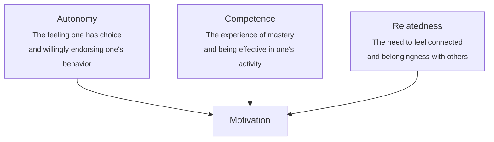

```mermaid
flowchart TD
    A[Autonomy<br><sub>The feeling one has choice<br>and willingly endorsing one's behavior</sub>]
    B[Competence<br><sub>The experience of mastery<br>and being effective in one's activity</sub>]
    C[Relatedness<br><sub>The need to feel connected<br>and belongingness with others</sub>]
    M[Motivation]

    A --> M
    B --> M
    C --> M
```