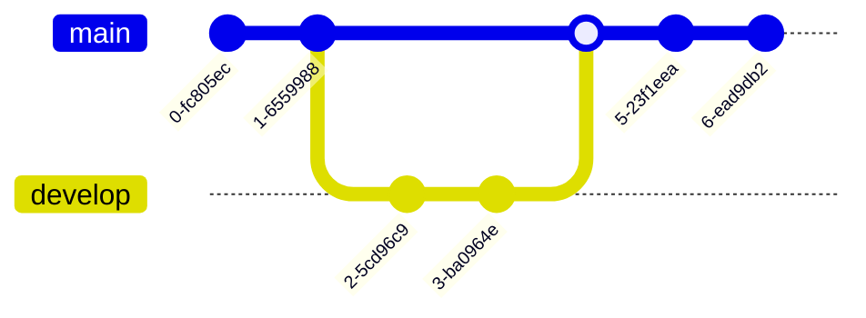

# Mermaid to Excalidraw API

At the moment the mermaid-to-excalidraw works in two steps. First, you call `parseMermaidToExcalidraw(mermaidSyntax)` on the mermaid diagram definition string, which resolves with elements in a skeleton format — a simplified excalidraw JSON format (docs coming soon). You then pass them to `convertToExcalidrawElements(elements)` to get the fully qualified excalidraw elements you can render in the editor.

The need for these two steps is due to the [@excalidraw/excalidraw](https://docs.excalidraw.com/docs/@excalidraw/excalidraw/installation) being a **UMD** build so we currently cannot import the `convertToExcalidrawElements()` util alone, until we support a tree-shakeable **ESM** build.

## parseMermaidToExcalidraw [​](https://docs.excalidraw.com/docs/@excalidraw/mermaid-to-excalidraw/api/#parsemermaidtoexcalidraw "Direct link to heading")

This API receives the mermaid syntax as the input, and resolves to skeleton Excalidraw elements. You will need to call `convertToExcalidraw` API to convert them to fully qualified elements that you can render in Excalidraw.

**Example**

```jsx
import { parseMermaidToExcalidraw } from "@excalidraw/mermaid-to-excalidraw";
import { convertToExcalidrawElements}  from "@excalidraw/excalidraw"
try {
  const { elements, files } = await parseMermaidToExcalidraw(mermaidSyntax: string, {
    fontSize: number,
  });
  const excalidrawElements = convertToExcalidrawElements(elements);
  // Render elements and files on Excalidraw
} catch (e) {
  // Parse error, displaying error message to users
}

```

## Supported Diagram Types [​](https://docs.excalidraw.com/docs/@excalidraw/mermaid-to-excalidraw/api\#supported-diagram-types "Direct link to heading")

Currently only [flowcharts](https://mermaid.js.org/syntax/flowchart.html) are supported. Oother diagram types will be rendered as an image in Excalidraw.

### Flowchart [​](https://docs.excalidraw.com/docs/@excalidraw/mermaid-to-excalidraw/api\#flowchart "Direct link to heading")

#### Excalidraw Regular Shapes [​](https://docs.excalidraw.com/docs/@excalidraw/mermaid-to-excalidraw/api\#excalidraw-regular-shapes "Direct link to heading")

**Rectangles**, **Circle**, **Diamond**, and **Arrows** are fully supported in Excalidraw


#### Subgraphs [​](https://docs.excalidraw.com/docs/@excalidraw/mermaid-to-excalidraw/api\#subgraphs "Direct link to heading")

Subgraphs are grouped diagrams hence they are also supported in Excalidraw


#### Unsupported shapes fallback to Rectangle [​](https://docs.excalidraw.com/docs/@excalidraw/mermaid-to-excalidraw/api\#unsupported-shapes-fallback-to-rectangle "Direct link to heading")

**Subroutine**, **Cylindrical**, **Asymmetric**, **Hexagon**, **Parallelogram**, **Trapezoid** are not supported in Excalidraw hence they fallback to the closest shape **Rectangle**


The above shapes are not supported in Excalidraw hence they fallback to Rectangle


#### Markdown fallback to Regular text [​](https://docs.excalidraw.com/docs/@excalidraw/mermaid-to-excalidraw/api\#markdown-fallback-to-regular-text "Direct link to heading")

Since we don't support wysiwyg text editor yet, hence [Markdown Strings](https://mermaid.js.org/syntax/flowchart.html#markdown-strings) will fallback to regular text.


#### Basic FontAwesome fallback to text [​](https://docs.excalidraw.com/docs/@excalidraw/mermaid-to-excalidraw/api\#basic-fontawesome-fallback-to-text "Direct link to heading")

The [FontAwesome](https://mermaid.js.org/syntax/flowchart.html#basic-support-for-fontawesome) icons aren't support so they won't be rendered in Excalidraw


#### Cross Arrow head fallback to Bar Arrow head [​](https://docs.excalidraw.com/docs/@excalidraw/mermaid-to-excalidraw/api\#cross-arrow-head-fallback-to-bar-arrow-head "Direct link to heading")


## Unsupported Diagram Types [​](https://docs.excalidraw.com/docs/@excalidraw/mermaid-to-excalidraw/api\#unsupported-diagram-types "Direct link to heading")

Currently only [flowcharts](https://mermaid.js.org/syntax/flowchart.html) are supported. All other diagram types will be rendered as an image in Excalidraw.





- [parseMermaidToExcalidraw](https://docs.excalidraw.com/docs/@excalidraw/mermaid-to-excalidraw/api#parsemermaidtoexcalidraw)
- [Supported Diagram Types](https://docs.excalidraw.com/docs/@excalidraw/mermaid-to-excalidraw/api#supported-diagram-types)
  - [Flowchart](https://docs.excalidraw.com/docs/@excalidraw/mermaid-to-excalidraw/api#flowchart)
    - [Excalidraw Regular Shapes](https://docs.excalidraw.com/docs/@excalidraw/mermaid-to-excalidraw/api#excalidraw-regular-shapes)
    - [Subgraphs](https://docs.excalidraw.com/docs/@excalidraw/mermaid-to-excalidraw/api#subgraphs)
    - [Unsupported shapes fallback to Rectangle](https://docs.excalidraw.com/docs/@excalidraw/mermaid-to-excalidraw/api#unsupported-shapes-fallback-to-rectangle)
    - [Markdown fallback to Regular text](https://docs.excalidraw.com/docs/@excalidraw/mermaid-to-excalidraw/api#markdown-fallback-to-regular-text)
    - [Basic FontAwesome fallback to text](https://docs.excalidraw.com/docs/@excalidraw/mermaid-to-excalidraw/api#basic-fontawesome-fallback-to-text)
    - [Cross Arrow head fallback to Bar Arrow head](https://docs.excalidraw.com/docs/@excalidraw/mermaid-to-excalidraw/api#cross-arrow-head-fallback-to-bar-arrow-head)
- [Unsupported Diagram Types](https://docs.excalidraw.com/docs/@excalidraw/mermaid-to-excalidraw/api#unsupported-diagram-types)