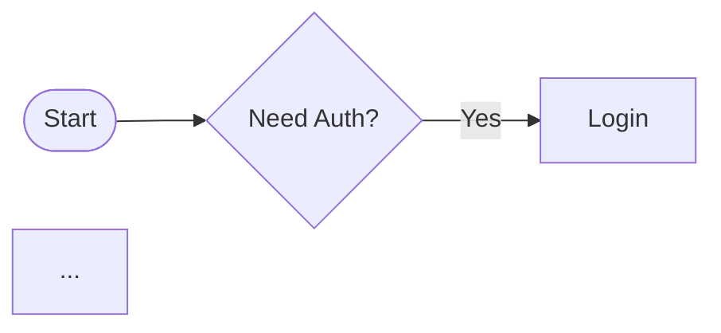

# Flowrender: CI + local rendering of Mermaid-based flowcharts (sketch style)

This folder contains a headless renderer that converts Mermaid flowcharts in `.md`/`.mmd` files into SVG and PNG assets using our D3 + Dagre + Rough.js pipeline (AST-first parsing). It works locally and in GitHub Actions.

## Where outputs go
- Generated assets are written to `mermaid_js/generated/`, mirroring input subdirectories.
- Example: `mermaid_js/examples/sample_flow.md` →
  - `mermaid_js/generated/examples/sample_flow.svg`
  - `mermaid_js/generated/examples/sample_flow.png`

You can reference these directly in blog markdown or presentations.

## Add a new diagram
1. Create a `.md` (or `.mmd`) file anywhere under `mermaid_js/`.
2. Optional YAML frontmatter overrides (first block); first ```mermaid fenced block is used.

```markdown
---
rankdir: LR
nodesep: 120
ranksep: 140
startGap: 16
endGap: 24
labelOffset: 16
roughness: 1.8
curveTightness: 0.25
fontFamily: 'Architects Daughter, cursive'
fontMaxPx: 18
fontMinPx: 10
stroke: '#7B61FF'
fill: '#EFEAFF'
---


```

3. Commit and push. The CI job will render SVG+PNG and commit to `mermaid_js/generated/`.

## Use in your blog/presentation
- Markdown: ``
- HTML: ``

## Commands (local)
- Install Playwright Chromium once:

```bash
npm run install-playwright
```

- Render one file:

```bash
npm run flowrender -- --in mermaid_js/examples/sample_flow.md --out mermaid_js/generated/examples/sample_flow.svg
npm run flowrender -- --in mermaid_js/examples/sample_flow.md --out mermaid_js/generated/examples/sample_flow.png
```

- Render all `.md`/`.mmd` under `mermaid_js/`:

```bash
npm run flowrender:all
```

## GitHub Actions
Workflow: [.github/workflows/flowrender.yml](../.github/workflows/flowrender.yml)
- Triggers: push to `mermaid_js/**/*.md|.mmd` (and renderer/styles) and manual dispatch
- Steps: install deps → install Chromium → render all → upload artifacts → auto-commit `mermaid_js/generated/**`

Artifacts are also available in the workflow run for download.

## Notes & troubleshooting
- This pipeline uses a headless browser (Chromium) for accurate text metrics and Rough.js output.
- If CI fails on Playwright install, rerun with `--with-deps` (already configured). Locally, ensure `npm run install-playwright` has been run at least once.
- If you need vector PDF: render SVG and convert with your preferred tool (or use the in-browser export PDF which rasterizes to a page-sized PDF).

## Advanced
- Styles are defined via CSS variables in [styles/flowchart.css](styles/flowchart.css).
- The interactive demo is [flowchart_external.html](flowchart_external.html) (supports file upload and exports from the browser).
