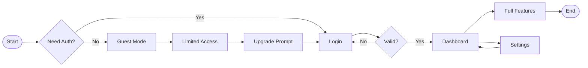

```mermaid
flowchart LR
A(["Start"]) --> B{"Need Auth?"}
B -->|Yes| C["Login"]
B -->|No| D["Guest Mode"]
C --> E{"Valid?"}
E -->|Yes| F["Dashboard"]
E -->|No| C
D --> G["Limited Access"]
F --> H["Full Features"]
G --> I["Upgrade Prompt"]
H --> J(["End"]) 
I --> C
F --> K["Settings"]
K --> F
```
